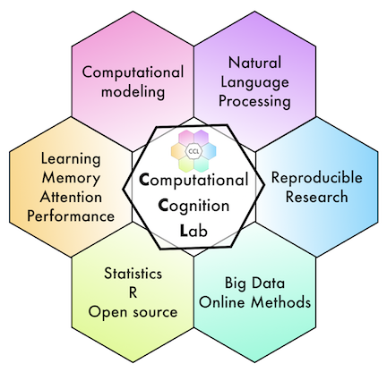

```{r setup, include=FALSE}
knitr::opts_chunk$set(echo = TRUE)
```

```{r, out.width="25%", echo=FALSE, fig.align="center"}

```

You have completed the task. Thank you for participating.

Your completion code will be displayed on the next page.

If you completed this study on SONA, then click the button to receive your participation credit.

<button type="button" id="continue" class="jspsych-btn">Continue</button>
