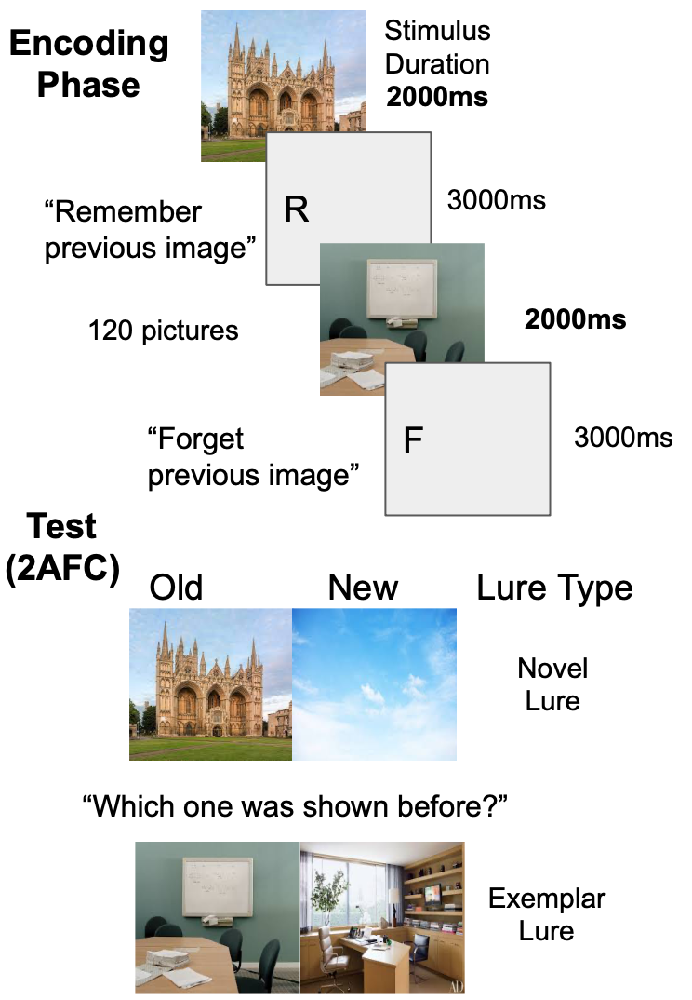
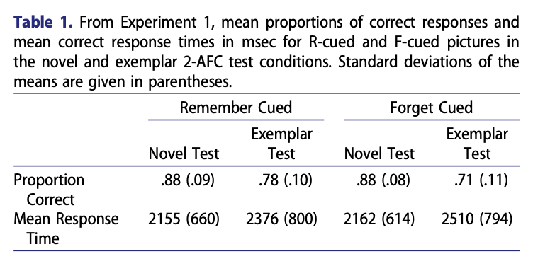
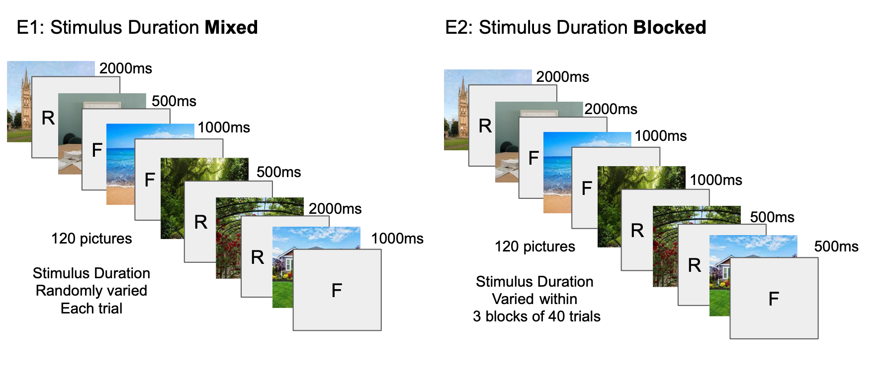

```{r setup, include=FALSE}
knitr::opts_chunk$set(echo = FALSE,
                      warning=FALSE,
                      message=FALSE)

library(RColorBrewer)
library(ggplot2)
```

# What is Directed Forgetting?

Directed forgetting research investigates people's ability to intentionally forget information [@macleodDirectedForgetting1998]. For example, in a memory task for words participants are instructed to remember some words and forget others for a later memory test. A directed forgetting effect is observed when people show worse memory for the words they attempted to forget. Directed forgetting tasks often use word stimuli, and the limitations of intentional forgetting for other kinds of information remain unclear.

We are investigating directed forgetting for pictures. The picture-superiority effect suggests that pictures are inherently more memorable than words [@gehring1976recognition].  @standingLearning10000Pictures1973 showed that people had little difficulty in memorizing over 10,000 pictures.


# Can people intentionally forget memorable picture information?

## Prior work: Limited Directed Forgetting for Pictures


:::: {.row}
::: {.col-md-6 .draw-border}

```{r, out.width="100%"}

```

:::

::: {.col-md-6}

## Prior Results

Reproduction of the results from @ahmadDirectedForgettingCategorised2019.

```{r, out.width="100%"}

tan_et_al <- data.frame(`Proportion Correct` = c(.88,.78,.88,.71),
                        `Lure Type` = c("novel","exemplar","novel","exemplar"),
                        `Encoding Cue` = c("Remember","Remember","Forget","Forget"))

ggplot(tan_et_al,aes(x=Lure.Type, y=Proportion.Correct,fill=Encoding.Cue))+
  geom_bar(stat="identity", position="dodge")+
  coord_cartesian(ylim=c(.4,1))+
  geom_hline(yintercept=.5)+
  scale_y_continuous(breaks = seq(0.4,1,.1))+
  theme_classic(base_size=20) +
  ylab("Proportion Correct")+
  xlab("Lure Type")+
  scale_fill_brewer(palette = "Accent")+
  theme_classic(base_size=20)+ggtitle("")+
  theme(legend.position = "top",
        plot.margin = unit(c(-2,0,0,0),units="line"),
        legend.margin = unit(c(-1,0,0,0),units="line"))+
  labs(fill = "Encoding Cue")

#
```


- They found a small directed forgetting effect. 
- The effect was only observed for items given a more difficult recognition test, involving a similar (exemplar) lure.

:::
::::

# Are pictures easier to forget if they are made less memorable?


:::: {.row}
::: {.col-md-6}

## Hypothesis 

1. We assume that the magnitude of directed forgetting is influenced by stimulus encoding strength:
 - Strongly encoded stimuli are harder to forget
 - Wakly encoded stimuli are easier to forget
 
2. We propose that decreasing stimulus duration during encoding will make pictures less well encoded, and easier to forget

3. We predict the directed forgetting effect will increase as stimulus duration decreases.


:::

::: {.col-md-6}

## Predicted effect of stimulus duration manipulation 

```{r, out.width = '100%'}
power <- new.env()
load("../vignettes/data/power.RData", power)
power$power_analysis$prediction_graph +
  scale_fill_brewer(palette = "Accent")+
  theme_classic(base_size=20)+ggtitle("")+
  theme(legend.position = "top",
        plot.margin = unit(c(-2,0,0,0),units="line"),
        legend.margin = unit(c(-1,0,0,0),units="line"))+
  labs(fill = "Encoding Cue")

```

:::
::::


# Methods: We conducted a replication of Ahmad et al. (2019) and manipulated stimulus duration during encoding to reduce picture memorability

:::: {.row}
::: {.col-md-6}

- 2 close replications of @ahmadDirectedForgettingCategorised2019.
- used the same set of natural scenes
- 47 and 45 participants recruited from Amazon's Mechanical Turk

:::

::: {.col-md-6}

- Programmed the experiment using JsPsych [@de2015jspsych]
- Participants completed the experiment in their web-browser

:::
::::

```{r, out.width="100%"}

```


# Results: Inconsistent directed forgetting effects

:::: {.row}
::: {.col-md-6}

## E1 Mixed

```{r, out.width = '100%'}
E1 <- new.env()
load("../vignettes/data/E1/E1_data_write_up.RData", E1)
E1$Accuracy$graphs$figure+
  scale_fill_brewer(palette = "Accent")+
  theme_classic(base_size=20)+ggtitle("")+
  theme(legend.position = "top",
        plot.margin = unit(c(-2,0,0,0),units="line"),
        legend.margin = unit(c(-1,0,0,0),units="line"))+
  labs(fill = "Encoding Cue")
```

:::

::: {.col-md-6}

## E2 Blocked

```{r, out.width = '100%'}
E2 <- new.env()
load("../vignettes/data/E2/E2_data_write_up.RData", E2)
E2$Accuracy$graphs$figure+
  scale_fill_brewer(palette = "Accent")+
  theme_classic(base_size=20)+ggtitle("")+
  theme(legend.position = "top",
        plot.margin = unit(c(-2,0,0,0),units="line"),
        legend.margin = unit(c(-1,0,0,0),units="line"))+
  labs(fill = "Encoding Cue")
```

:::
::::

:::: {.row}
::: {.col-md-6}

## E3 N=17 (ongoing)

```{r, out.width = '100%'}
E3 <- new.env()
load("../vignettes/data/E3/E3_data_write_up.RData", E3)
E3$Accuracy$graphs$figure+
  scale_fill_brewer(palette = "Accent")+
  theme_classic(base_size=20)+ggtitle("")+
  theme(legend.position = "top",
        plot.margin = unit(c(-2,0,0,0),units="line"),
        legend.margin = unit(c(-1,0,0,0),units="line"))+
  labs(fill = "Encoding Cue")
```

:::

::: {.col-md-6}

## Conclusions and Next Steps

1. We did not replicate @ahmadDirectedForgettingCategorised2019
2. Our power analysis suggests we need over 200 subjects to reliably detect the higher-order interaction
3. Online experiment design should be considered.

:::
::::


## Project website <https://www.crumplab.com/PatrickHonorsThesis/>

This poster was prepared as a computationally reproducible project using [vertical](https://www.crumplab.com/vertical/) [@vuorre2021sharing], and several libraries from the open-source community.

```{r, include=FALSE}
knitr::write_bib(c('knitr','rmarkdown','posterdown','pagedown'), 'packages.bib')
```

# References
