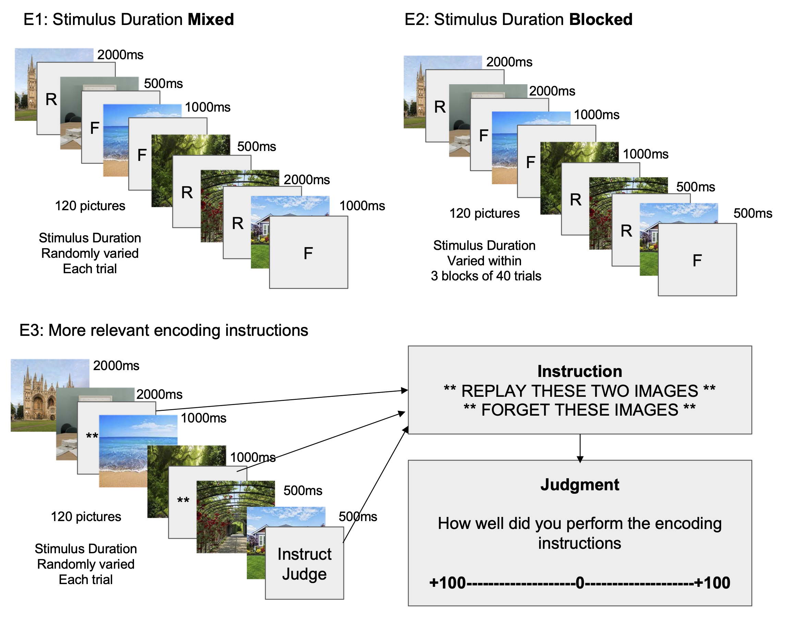

```{r setup, include=FALSE}
knitr::opts_chunk$set(echo = FALSE,
                      warning=FALSE,
                      message=FALSE)

library(RColorBrewer)
library(ggplot2)
```

# What is Directed Forgetting?

Directed forgetting research investigates people's ability to intentionally forget information [@macleodDirectedForgetting1998]. For example, in a memory task for words participants are instructed to remember some words and forget others for a later memory test. A directed forgetting effect is observed when people show worse memory for the words they attempted to forget. Directed forgetting tasks often use word stimuli, and the limitations of intentional forgetting for other kinds of information remain unclear.

# Can people intentionally forget memorable picture information?

The picture-superiority effect suggests that pictures are inherently more memorable than words [@gehring1976recognition], and people have a large capacity for remembering pictures [@standingLearning10000Pictures1973].

@ahmadDirectedForgettingCategorised2019 showed small directed forgetting effects for pictures.

## Prior work: Limited Directed Forgetting for Pictures

:::: {.row}
::: {.col-md-6 .draw-border}

```{r, out.width="100%"}
knitr::include_graphics("imgs/Tan_methods_vertical.png")
```

:::

::: {.col-md-6}

## Prior Results

Reproduction of the results from @ahmadDirectedForgettingCategorised2019.

```{r, out.width="100%"}

tan_et_al <- data.frame(`Proportion Correct` = c(.88,.78,.88,.71),
                        `Lure Type` = c("novel","exemplar","novel","exemplar"),
                        `Encoding Cue` = c("Remember","Remember","Forget","Forget"))

ggplot(tan_et_al,aes(x=Lure.Type, y=Proportion.Correct,fill=Encoding.Cue))+
  geom_bar(stat="identity", position="dodge")+
  coord_cartesian(ylim=c(.4,1))+
  geom_hline(yintercept=.5)+
  scale_y_continuous(breaks = seq(0.4,1,.1))+
  theme_classic(base_size=20) +
  ylab("Proportion Correct")+
  xlab("Lure Type")+
  scale_fill_brewer(palette = "Accent")+
  theme_classic(base_size=20)+ggtitle("")+
  theme(legend.position = "top",
        plot.margin = unit(c(-2,0,0,0),units="line"),
        legend.margin = unit(c(-1,0,0,0),units="line"))+
  labs(fill = "Encoding Cue")

#knitr::include_graphics("imgs/Tan_results.png")
```


- They found a small directed forgetting effect. 

- The effect was only observed for items given a more difficult recognition test, involving a similar (exemplar) lure.

:::
::::

# Are pictures easier to forget if they are made less memorable?


:::: {.row}
::: {.col-md-6}

## Hypothesis 

We **assume** the magnitude of directed forgetting is influenced by stimulus encoding strength

::: {.smaller}

 - Strongly encoded stimuli are harder to forget
 
 - Weakly encoded stimuli are easier to forget
 
We **assume** decreasing stimulus duration will make pictures less well encoded, and easier to forget

We **predict** increased directed forgetting as stimulus duration decreases.

:::

:::

::: {.col-md-6}

## Predicted effect of stimulus duration manipulation 

```{r, out.width = '100%'}
power <- new.env()
load("../vignettes/data/power.RData", power)
power$power_analysis$prediction_graph +
  scale_fill_brewer(palette = "Accent")+
  theme_classic(base_size=20)+ggtitle("")+
  theme(legend.position = "top",
        plot.margin = unit(c(-2,0,0,0),units="line"),
        legend.margin = unit(c(-1,0,0,0),units="line"))+
  labs(fill = "Encoding Cue")

```

:::
::::


# Methods: 3 close replications of Ahmad et al. (2019) with stimulus duration manipulation to reduce picture memorability

:::: {.row}
::: {.col-md-6}

::: {.smaller}

Stimulus duration was 2, 1, or .5 seconds.

:::

:::

::: {.col-md-6}

::: {.smaller}

Online experiments using JsPsych [@de2015jspsych]


:::

:::
::::

```{r, out.width="100%"}

```


# Results: Inconsistent directed forgetting effects

:::: {.row}
::: {.col-md-6}

## E1 Mixed (N=47 MTURK)

```{r, out.width = '100%'}
E1 <- new.env()
load("../vignettes/data/E1/E1_data_write_up.RData", E1)
E1$Accuracy$graphs$figure+
  scale_fill_brewer(palette = "Accent")+
  theme_classic(base_size=20)+ggtitle("")+
  theme(legend.position = "top",
        plot.margin = unit(c(-2,0,0,0),units="line"),
        legend.margin = unit(c(-1,0,0,0),units="line"))+
  labs(fill = "Encoding Cue")
```

:::

::: {.col-md-6}

## E2 Blocked (N=45 CUNY)

```{r, out.width = '100%'}
E2 <- new.env()
load("../vignettes/data/E2/E2_data_write_up.RData", E2)
E2$Accuracy$graphs$figure+
  scale_fill_brewer(palette = "Accent")+
  theme_classic(base_size=20)+ggtitle("")+
  theme(legend.position = "top",
        plot.margin = unit(c(-2,0,0,0),units="line"),
        legend.margin = unit(c(-1,0,0,0),units="line"))+
  labs(fill = "Encoding Cue")
```

:::
::::

:::: {.row}
::: {.col-md-6}

## E3 (N=17 ongoing)

```{r, out.width = '100%'}
E3 <- new.env()
load("../vignettes/data/E3/E3_data_write_up.RData", E3)
E3$Accuracy$graphs$figure+
  scale_fill_brewer(palette = "Accent")+
  theme_classic(base_size=20)+ggtitle("")+
  theme(legend.position = "top",
        plot.margin = unit(c(-2,0,0,0),units="line"),
        legend.margin = unit(c(-1,0,0,0),units="line"))+
  labs(fill = "Encoding Cue")
```

:::

::: {.col-md-6}

## Conclusions and Next Steps

::: {.smaller}

1. No consistent directed forgetting effects

2. Our power analysis suggests we need many more subjects to detect interactions with stimulus duration

3. We are tuning the task instructions for web-browser interactions to encourage participants to engage with instructional cues.

:::

:::
::::


## Project website

Click the QR code, or go here:

<https://crumplab.com/picture-duration-directed-forgetting/>

This poster was prepared as a computationally reproducible project using a [vertical](https://www.crumplab.com/vertical/) [@vuorre2021sharing] approach, and several other libraries from the open-source community.

This website contains the source code for this poster, and the most up-to-date analyses and project assets.

```{r, include=FALSE}
knitr::write_bib(c('knitr','rmarkdown','posterdown','pagedown'), 'packages.bib')
```

# References
